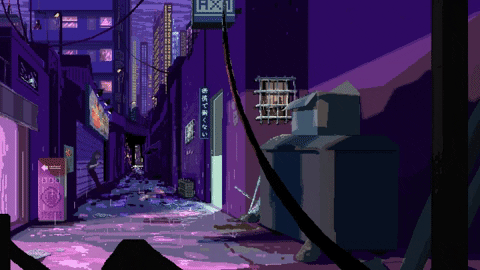

 
Background GIF by [Axel Oil](https://giphy.com/gifs/pixel-pixelart-axeloil-RgZFvGuI4OxLjuSvRF)

Experienced Software Developer adept in bringing forth expertise in design, installation, testing and maintenance of software systems. Able to effectively self-manage during independent projects, as well as collaborate as part of a productive team. Equipped with a diverse and promising skill-set.

 &nbsp;

## 🧰 Languages and Tools

 

## 📊 Stats

 

